### [This tutorial is under development. Thank you for your patience]

# Introduction

This tutorial will show you how to set up the same infrastructure (called from now on *base infrastructure*) Slalom provided to the attendees during the event.

The steps in this tutorial will be targeted at Mac OS and Linux systems. However, if you are using Windows, external links will be provided with further instructions.

# The base infrastructure

The resources launched as part of the solution for the challenge **are not** considered base infrastructure. The base infrastructure on both AWS and Google Cloud (GCP) consists of an AMI on AWS for API 1 and an instance image on GCP for API 2.

# tl;dr

Here's a short summary of what you need to do to set up the base infrastructure. On both AWS and GCP, launch a Virtual Machine using Ubuntu as base image (you can choose other Linux distro if you want, but this tutorial will be for Ubuntu) and [install Node.js 8](https://github.com/nodesource/distributions). Copy the contents of the API 1 and API 2 folders to these machines (find the code for both APIs in the `apis` folder in this repository). Run `npm install` inside each api folder and then run `node index.js &`. Curl localhost (port 3000 for API 1 and port 5000 for API 2). If you get a response, you're in the right path.

Next step is to automate starting up these APIs during launch time. Create the following cronjob:

```
@reboot forever start --watch --watchDirectory /home/ubuntu/api-1/config/ /home/ubuntu/api-1/index.js
```

Replace the paths above accordingly. Note: both `--watch` and `--watchDirectory` are necessary for Stage 5.

Stop and start both Virtual Machines and check that the API starts automatically by curling localhost. If that happens, you're ready to go: create an image for API 1 and API 2 and use those IDs in your solution.

If you are still in doubt about the procedures above and do not know what to do, please keep reading as we'll do it step by step.

# Step By Step

## AWS

Let's start with AWS first. [Log in to your AWS account if you have one. If you do have an account, create one](https://aws.amazon.com/).

### Launching an EC2 instance

Once you are logged in to the console, select the region you want to work on. In this tutorial, I'll be working on the `sa-east-1` (São Paulo) region, so beware of region-specific info like AMI IDs. Once you select your region, click on **EC2**:

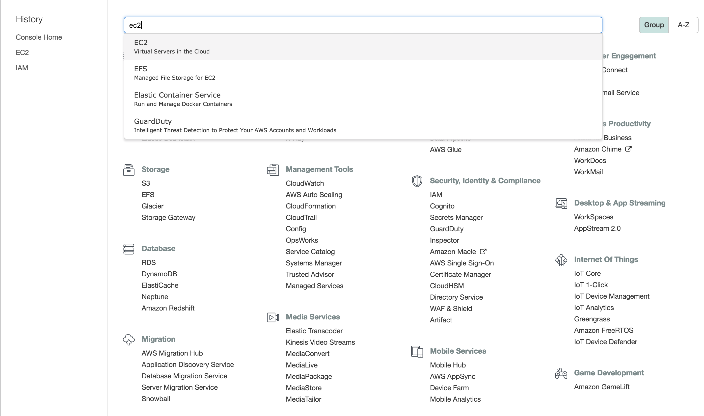

Now click on **Launch Instance** and select the *Ubuntu Server 16.04 LTS (HVM), SSD Volume Type* AMI:

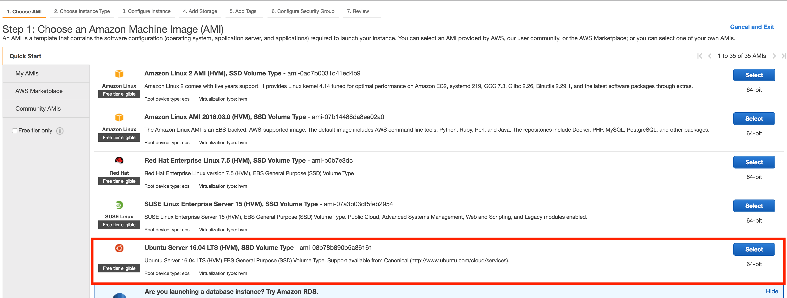

If your account is new (less than 12 months old) you're eligible for the free tier. In this case, choose **t2.micro**. If you are not eligible for free tier, choose **t3.nano** (it's the cheapest).

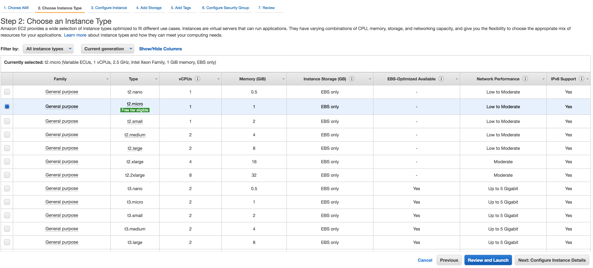

On the Configure Instance Details page, choose a VPC (it can be the default one), choose a public subnet, and enable **Auto-assign Public IP**. Then click on **Review and Launch**:

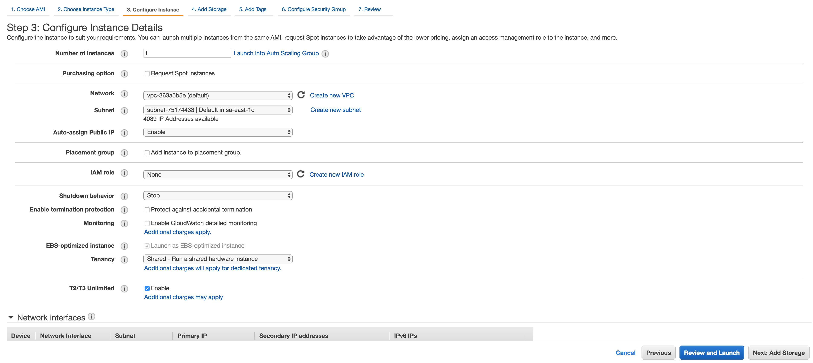

The storage size of 8 GB is more than enough. Click on **Next: Add Tags**. Add any tag you wish, then click on **Next: Configure Security Group**. Create a new security group. Give it a name, description, and select **My IP** under **Source** (the field should be filled in with your external IP address). Once you're done, click on **Review and Launch**:

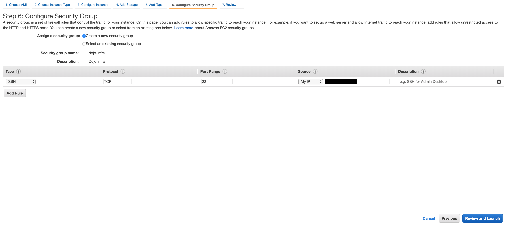

Review everything and click on **Launch**. When asked about a key pair, if you haven't got one yet, create and download it:


Finally, click on **Launch Instances**. 

### Connecting to the instance

Before connecting to the instance, grab its Public IP:


[If you are a Windows user, please follow this tutorial to connect to the instance](https://docs.aws.amazon.com/AWSEC2/latest/UserGuide/putty.html).

For Linux and Mac users, open the Terminal and type in the following command to protect your newly created private key:

```
$ chmod 600 PRIVATE_KEY_PATH
```

Now, run the following command:

```
$ ssh -i PRIVATE_KEY_PATH ubuntu@IP_ADDRESS
Welcome to Ubuntu 16.04.5 LTS (GNU/Linux 4.4.0-1065-aws x86_64)

 * Documentation:  https://help.ubuntu.com
 * Management:     https://landscape.canonical.com
 * Support:        https://ubuntu.com/advantage

  Get cloud support with Ubuntu Advantage Cloud Guest:
    http://www.ubuntu.com/business/services/cloud

0 packages can be updated.
0 updates are security updates.


The programs included with the Ubuntu system are free software;
the exact distribution terms for each program are described in the
individual files in /usr/share/doc/*/copyright.

Ubuntu comes with ABSOLUTELY NO WARRANTY, to the extent permitted by
applicable law.

To run a command as administrator (user "root"), use "sudo <command>".
See "man sudo_root" for details.

ubuntu@ip-xxx-xx-xx-xxx:~$
```

### <a name="systemconfig"></a>Configuring the system

Let's configure this server so we can later generate an AMI. First, clone this repository in Ubuntu's home directory:

```
$ git clone https://github.com/slalomdojo/terraform-challenge
Cloning into 'terraform-challenge'...
remote: Counting objects: 10, done.
remote: Compressing objects: 100% (10/10), done.
remote: Total 10 (delta 0), reused 10 (delta 0), pack-reused 0
Unpacking objects: 100% (10/10), done.
Checking connectivity... done.
```

Before we can test the API, we need to install Node.js 8:

```
$ curl -sL https://deb.nodesource.com/setup_8.x | sudo -E bash -; sudo apt-get install -y nodejs
[...]

$ node --version
v8.11.4

$ npm --version
5.6.0
```

If the instructions above did not work, follow the official instructions [here](https://github.com/nodesource/distributions).

Now let's just install all the dependencies the API needs:

```
$ cd terraform-challenge/run-your-own-dojo/apis/api-1
$ npm install
```

Finally, assuming you are still inside the api-1 folder, run:

```
$ node index.js &
```

You've just spun up the API on the background. Hit enter if necessary to get the prompt back and run:

```
$ curl localhost:3000/health
Ok
```

If you got an error like `Error: Cannot find module 'express'`, it means you haven't run `npm install`.

Now that we confirmed the API works, we need a way to start it automatically when a new instance comes up. To do that, let's first install [Forever](https://github.com/foreverjs/forever):

```
$ sudo npm install -g forever
```

To automatically start the API, let's not get too fancy for this exercise. A simple cronjob will be enough. Run:

```
$ crontab -l > cron

$ echo "@reboot forever start --watch --watchDirectory /home/ubuntu/terraform-challenge/run-your-own-dojo/apis/api-1/config/ /home/ubuntu/terraform-challenge/run-your-own-dojo/apis/api-1/index.js" >> cron

$ crontab cron
```

Confirm that your cronjob was installed successfully by running `crontab -l`.

If you are wondering what all this means, let me quickly explain: `@reboot` means the command should be run whenever the server reboots/starts up. `forever start` starts the API. `--watch --watchDirectory` watches the config directory and if any file changes, the API is restarted (you will need this functionality on Stage 5).

### Testing 

Before we generate the AMI, we need to be sure that the API is indeed starting up when the instance starts up. In order to verify that, perform the following steps:

  1) Stop the instance
  2) Start it again
  3) SSH into the instance
  4) Curl API 1 and see if it's running

### Generating the AMI

Assuming the testing went well, let's now build the AMI. Go back to the EC2 Console, locate your instance, select it, then click on **Actions, Image, Create Image**:

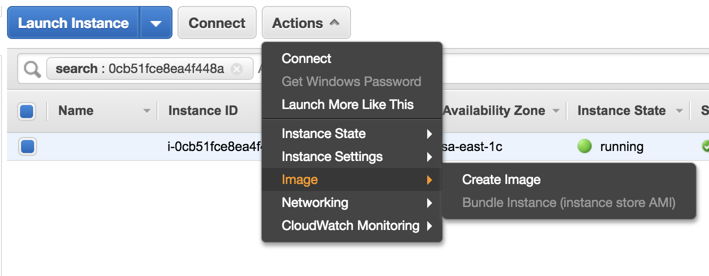

Give your AMI a name and description and hit **Create Image**.

Your base infrastructure on AWS is ready! Let's do the same on GCP now.

## GCP

Go to the [Google Cloud website](https://cloud.google.com/). If you have a Google Account, you can go to the Google Cloud Console and set up your account there. Otherwise, you'll have to first create a [Google Account](https://accounts.google.com/signup/v2/webcreateaccount?hl=en&flowName=GlifWebSignIn&flowEntry=SignUp). 
GCP also has some sort of free tier. They give you $300 to test their services for 12 months, which is more than enough if you're just getting started with their platform. 
This tutorial will not show you how to create a Google Cloud account as it's very straightforward. Before proceeding, set up an account and [Billing](https://cloud.google.com/billing/docs/how-to/manage-billing-account).

### Creating a project

First step will be to create a project. Take a look at the top bar:


Your top bar will probably have a project already select (e.g. 'My First Project' or something similar). Click on the dropdown icon and this window will pop up:

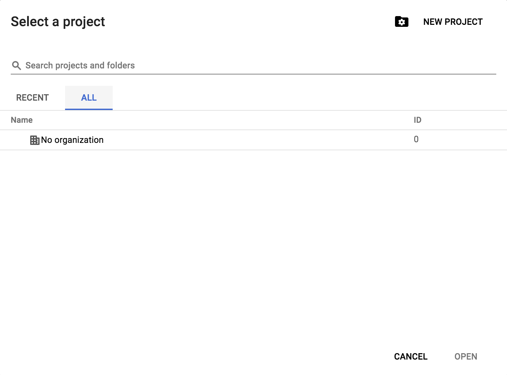

Click on the folder with a gear icon (left-hand side of **New Project**). Create a project choosing any name you'd like. In GCP, project names do not need to be unique. However, **IDs must be unique**. Project name and project IDs can be different, but I strongly suggest you use the same name for both.

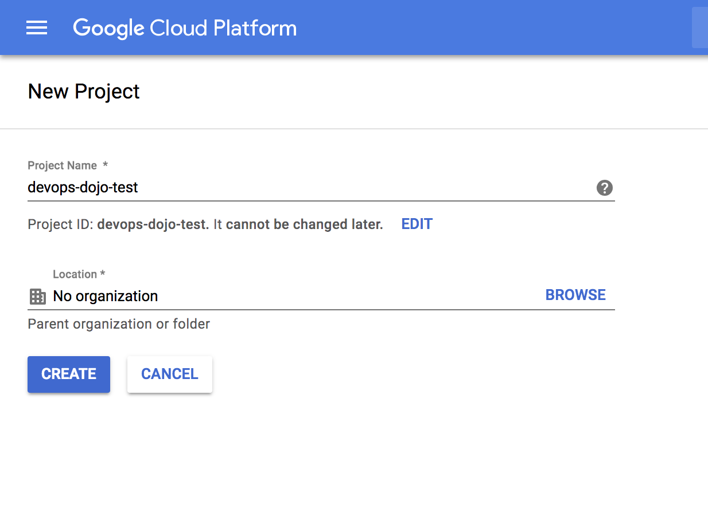

Once the project is created and you select it, you'll see its name at the top bar:

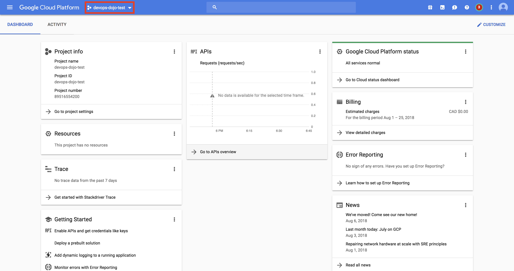

### Enable Billing

In GCP, every project needs to be associated with a Billing account. To make sure your project is associated with a Billing account, click on the menu (three horizontal bars at the top-left corner) and then click on Billing. If Billing is enabled, you'll see something like this:

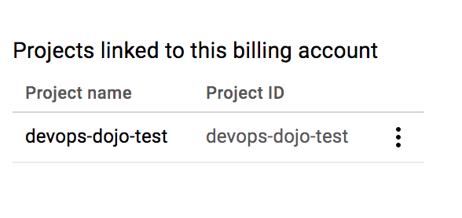

If Billing is not enabled, the page will ask you to enable Billing for the project.

### Creating the Instance

Now let's launch an instance and perform the same steps we did for AWS (install Node.js, pull the API code, set up a cron job and generate an image). Click on the menu again and then on **Compute Engine** (Compute Engine is GCP's EC2 service). In GCP, you need to enable APIs before you can start interacting with them. That's why if this is the first time you're interacting with Compute Engine on this project, you'll see a message saying that "Compute Engine is getting ready."

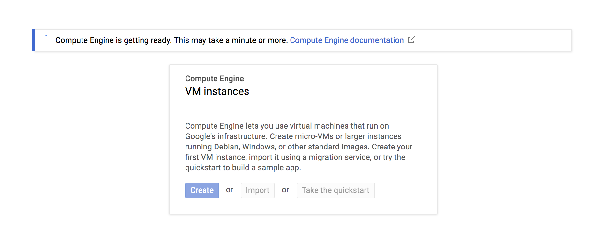

Wait a few minutes. Once the API is ready, click on **Create**. Now, use the following info to create the instance:

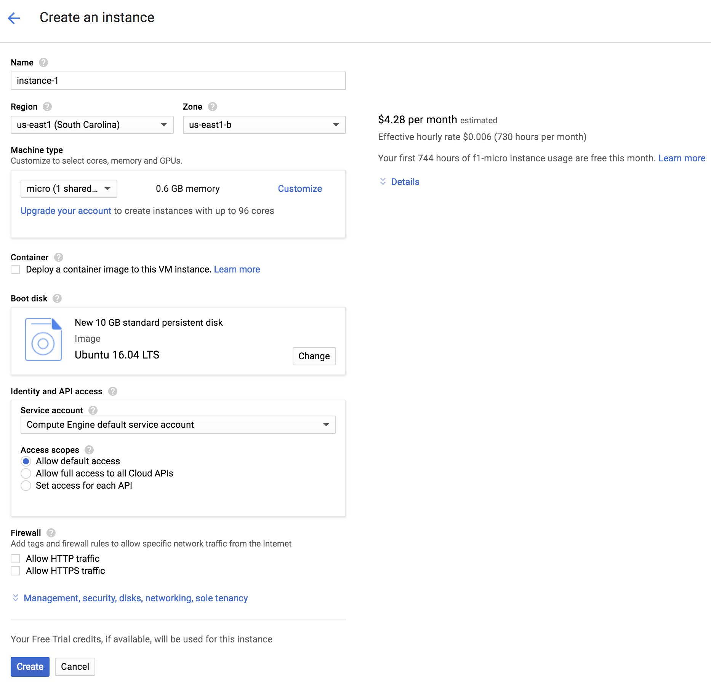

**Use Ubuntu 16.04 LTS for the boot disk.** Then, hit **Create**. 

Wait until the instance is ready (there will be a green check mark on the left-hand side of the instance name):

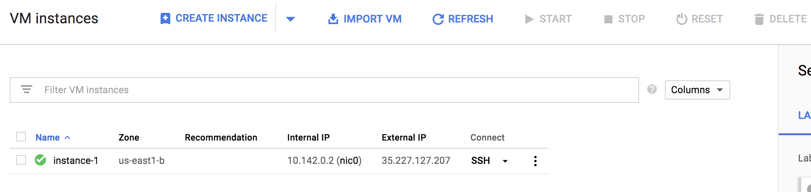

Click on **SSH** (underneath *Connect*). That will open a new window with a terminal (the [Google Cloud Shell](https://cloud.google.com/shell/docs/)). 

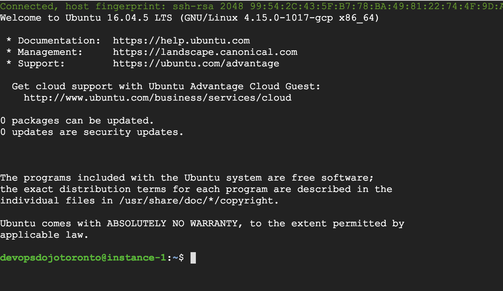

[Follow the steps we did for AWS to configure the system](#systemconfig). However, note the following:

* You will have to set up API 2 instead of API 1.
* The API 2 listens on port 5000 instead of 3000.
* There's no config folder for API 2, so forever doesn't have to watch any directory. Use the following command for the cron job:
  ```
  @reboot forever start $HOME/terraform-challenge/run-your-own-dojo/apis/api-2/index.js
  ```
  **Pay attention to the home directory path (it will be different than the one on EC2 instances)**

### Testing 

Perform the same steps as you did for the EC2 instance to make sure the API starts when the instance starts: stop the instance, start it again, ssh into the instance and curl the API. If it works, you're ready to generate an image. If it doesn't, create an issue explaining what went wrong and we'll do our best to help you.

### Generating an Image

Before generating an Image, **stop your instance**. Now, on the left panel, click on **Images**:

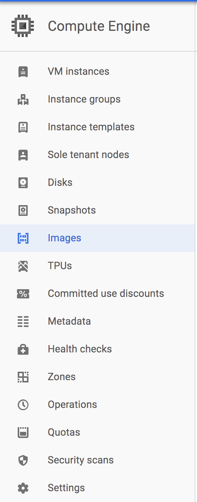

Click on **Create Image**, give it a name, select **Disk** as source, select your instance in the **Source disk** field and create the image:

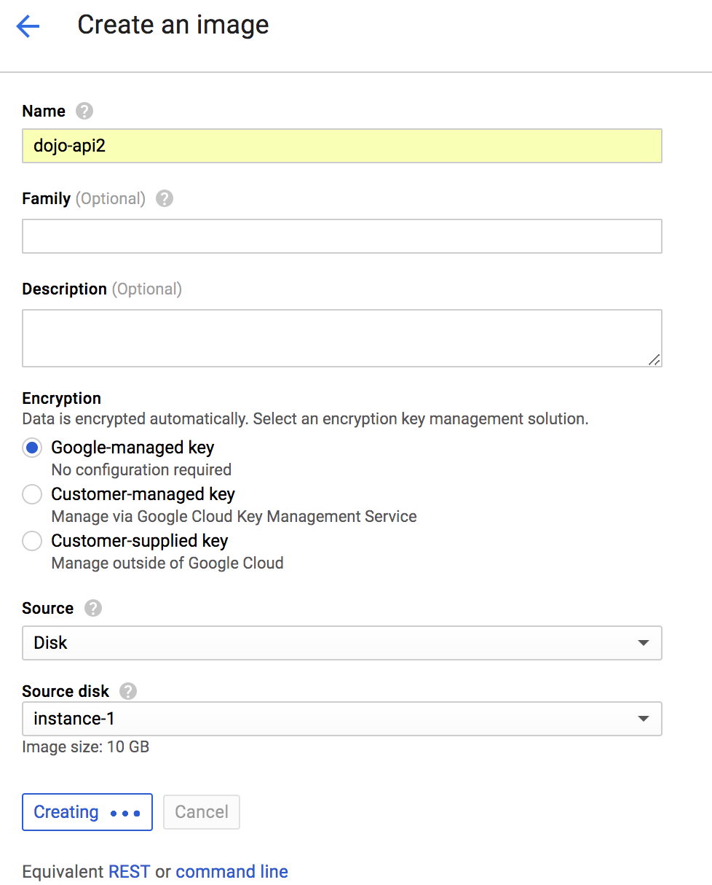

After the image is created, you'll see it in the list of images:

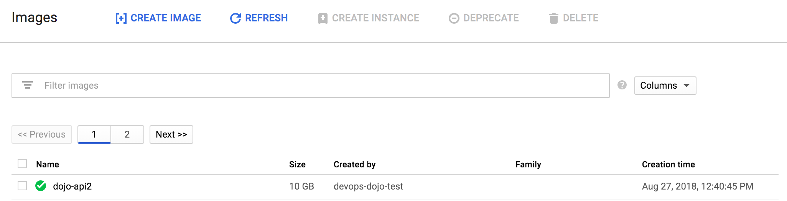

You're now ready to take the challenge! 

# What do I do if an run into an issue with the base infrastructure?

Please submit a Pull Request if there's a mistake in the tutorial or create an issue explaining what kind of error you're getting from your base infrastructure.
